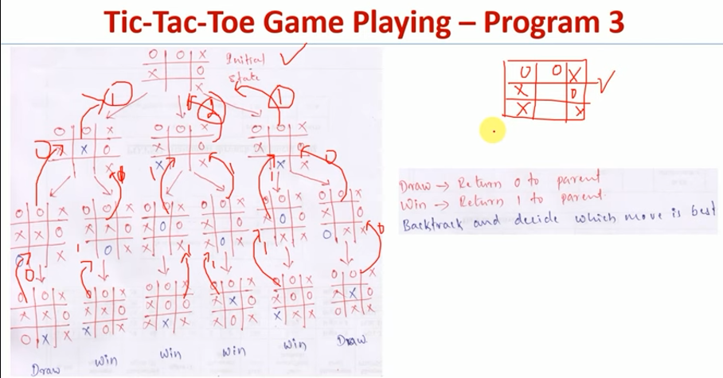
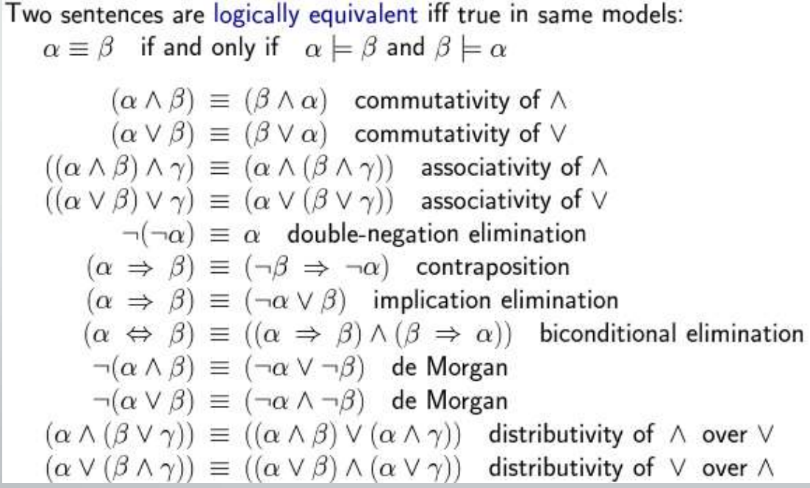

# theory - 

- introduction
- agents , Characteristics, agent function,
- PEAS
	- performance major, environment,  sensors, actuators,
- differ environment 
	- Fully Observable vs. Partially Observable
	- Deterministic vs. Stochastic
	- Episodic vs. Sequential
	- Static vs. Dynamic
	- Discrete vs. Continuous
	- Single Agent vs. Multiagent

- Agent types (with diagram)

- problem formulation (pg 111)
	- ex- 8 puzzel  
		- **Initial State**: A 3×3 grid with tiles placed in a random but valid configuration.
		- **Actions**: The blank tile can move left, right, up, or down (if within bounds).
		- **Transition Model**: Moving the blank tile swaps its position with the adjacent tile in the chosen direction.
		- **Goal Test**: The state matches the predefined goal configuration (e.g., tiles arranged in order from 1 to 8 with the blank at the bottom-right).
		- **Path Cost**: Each move has a uniform cost of 1 (total cost = number of moves).

# solve -

all algos => 
- Completeness: does it always find a solution if one exists?
- Time complexity: number of nodes generated
- Space complexity: maximum number of nodes in memory
- Optimality: does it always find a least-cost solution

## uninformed
- [bfs](https://www.youtube.com/watch?v=qul0f79gxGs) breadth wise
- [ucs](https://www.youtube.com/watch?v=xkcR8-NEI1g) g(s)
- [dfs](https://www.youtube.com/watch?v=cq0cBynFFXI) same line till end, then come up
- [dls](https://www.youtube.com/watch?v=P7WQUBLKDmo)
- [ids](https://www.youtube.com/watch?v=BK8cEWKHCkY)
- [bidirec](https://www.youtube.com/watch?v=rEema9uQ02c) both node breadth wise

## informed
- bestfs
	- [gbfs](https://www.youtube.com/watch?v=GVvN0ikNekw) h(s)
	- [A*](https://www.youtube.com/watch?v=iTG7NjQu0Qs)  g + h

## local search algo

- beam search algo

- [hill climbing (uses only h(n)!!)](https://www.youtube.com/watch?v=3SiWtAnUROs)
	- questions
		- [8 puzzel]()
		- n queen
		- [block world](https://www.youtube.com/watch?v=2SlO34_VsY4)
	- theory
		- Simulated Annealing (pg 353)
		- variants of HC (351)
		- [steepest vs basic](https://www.youtube.com/watch?v=Z1PjSvRC2vk)

- genetic algo
	- n queen

# irl problem

- [8 puzzel]
	- a*()
	- hill climbing
- [n queen]
	- gen ()
	- hill climbing

- [block world (hill climbing)](https://www.youtube.com/watch?v=2SlO34_VsY4)

- [monk and demon](https://youtu.be/yLEB-n4URu4)

## state space (theory)
- [water jug]()
- [vaccum cleaner](https://www.youtube.com/watch?v=ZBiHAUTYWVc)

-------------------------------------Midsem---------------------------------------

# Beyond Classical Search

## Concept of Constraint Satisfaction Problem , Formulation of problem into CSP. (Crypt-Arithmetic Problem and Map Coloring Problem).

- [CSP,Map Coloring Etc.](https://www.youtube.com/playlist?list=PL9EkTCQPPVmBL94p6ahSSVBIBOWKDURn1)
	- tic tac to  
- [Crypt-Arithmetic Problem](https://www.youtube.com/watch?v=aZblDSAx4cg)

## Adversarial Searching

- [Concept of Two Players Game](https://www.youtube.com/watch?v=_uFVLU3RTxQ)
- [Min-Max Algorithm](https://www.youtube.com/watch?v=tDv7lrklaQE&t=245s)
- [Alpha-Beta Pruning](https://www.youtube.com/watch?v=9D1hVGumxCo)

Crypt arithmetic proble
sudoku
tictacto

PDDL
# Knowledge Representation

- Refer Discrete Maths Classroom
- [First Order Predicate Logic ( FOL )](https://www.youtube.com/watch?v=wgb9_BJhaT0)
- [Unification]()

## Logical Agents

- [Knowledge Based Agents](https://www.youtube.com/watch?v=a_bXNyCR5Vs)
- [Wumpus World Example Path from square 1,1 to square 2,3 gold](https://www.youtube.com/watch?v=HjuauhCsXBg)
- [PEAS Wumpus World Example](https://www.youtube.com/watch?v=xSy2nwae2no)
- [Inference Rules Modes Ponens Modes Tollens in Propositional Logic](https://www.youtube.com/watch?v=DZXTVoSQzFo)
- Proposition 

# Planning 

- Dont Know

# Probabilistic Reasoning

- [Uncertainty](https://www.youtube.com/watch?v=dWQitocmGmY)
- [Bayesian networks](https://www.youtube.com/playlist?list=PLAQje4L5NVW7g6moHxjPiXcAqTcHwVaDI)
- [Inferences in Bayesian Network](https://www.youtube.com/watch?v=2zSgAHi8Zyk)

# already came in midsem
- bfs
- ids 
- 8 puzzel A*
- state space 
	- 8 puzzle
	- n queen
- steepest Hill Climbing
- Simulated Annealing
- genetic algo
